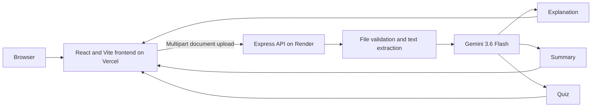

<div align="center">

# StudyAI

### Turn source material into a structured study guide, concise summary, and active-recall quiz.

[](https://hummy-study-assistent.vercel.app)
[](https://hummy-study-assistent-api.onrender.com/api/health)
[](https://react.dev/)
[](https://ai.google.dev/)

</div>

## Overview

StudyAI is a full-stack learning application that converts an uploaded document into three coordinated study resources:

1. A structured explanation grounded in the source material
2. A concise summary for fast revision
3. An interactive multiple-choice quiz for active recall

The public website includes a product landing page, a detailed features page, and a dedicated application workspace. The workspace uses a dashboard-style layout so file selection, generation status, study content, and quiz progress remain organized during longer sessions.

## Live Deployment

| Service | Platform | Production URL |
| --- | --- | --- |
| Frontend | Vercel | [hummy-study-assistent.vercel.app](https://hummy-study-assistent.vercel.app) |
| Backend API | Render | [hummy-study-assistent-api.onrender.com](https://hummy-study-assistent-api.onrender.com) |
| Health check | Render | [/api/health](https://hummy-study-assistent-api.onrender.com/api/health) |

The Render service currently uses the free plan. Its first request after an idle period can take longer while the service wakes up.

## Product Features

### Learning workflow

- Drag-and-drop or browse-based document upload
- PDF, TXT, Markdown, and PPTX support
- 15 MB upload limit with client and server validation
- Essential, Balanced, and In depth explanation modes
- Visible upload and generation progress
- Source-grounded explanation, summary, and quiz generation
- Immediate quiz feedback, progress tracking, and final scoring
- One-click reset for starting a new study session

### AI content presentation

- Structured Markdown headings and short readable sections
- GitHub-Flavored Markdown tables
- KaTeX-compatible inline and display mathematics
- Responsive table containers for smaller screens
- Styled code blocks, blockquotes, lists, and key terms
- Output normalization for common model formatting issues
- Prompt and response safeguards that prevent em dash characters from appearing in generated content

### Interface

- Premium responsive landing page
- Separate features page with visual product explanations
- Dedicated full-screen study workspace
- Workspace navigation, session status, and context panels
- Lazy-loaded routes for the landing, features, and workspace views
- Clear loading, empty, ready, and error states
- Keyboard-accessible controls and semantic status messaging

## Application Architecture



Uploaded files are stored only as temporary server files. The API removes each temporary file after the request succeeds or fails.

## Technology Stack

| Layer | Technology |
| --- | --- |
| Frontend | React 18, Vite 4, Tailwind CSS 3 |
| UI and motion | React Icons, Framer Motion |
| API client | Axios |
| Content rendering | react-markdown, remark-gfm, remark-math |
| Mathematics | KaTeX, rehype-katex |
| Backend | Node.js, Express |
| Upload handling | Multer |
| Document extraction | pdf-parse and basic text extraction |
| AI provider | Google Gemini through `@google/genai` |
| Frontend hosting | Vercel |
| Backend hosting | Render |

## Project Structure

```text
Study-Assistant-AI-Integrated-Application/
|-- client/
|   |-- src/
|   |   |-- components/
|   |   |   |-- features/          # Feature page content and visuals
|   |   |   |-- landing/           # Landing page sections
|   |   |   |-- layout/            # Public header and footer
|   |   |   |-- study/             # Upload, guide, summary, quiz, loader
|   |   |   `-- workspace/         # Workspace shell and navigation
|   |   |-- hooks/                 # Hash route state
|   |   |-- pages/                 # Landing, features, workspace pages
|   |   |-- services/              # API client
|   |   `-- utils/                 # AI Markdown normalization
|   |-- .env.production            # Production Render API URL
|   |-- package.json
|   `-- vite.config.js
|-- server/
|   |-- controllers/               # Upload extraction and request handling
|   |-- routes/                    # API routes and Multer configuration
|   |-- services/                  # Gemini client and response safeguards
|   |-- utils/                     # Explanation, summary, and quiz prompts
|   |-- uploads/                   # Temporary uploads, ignored by Git
|   |-- index.js                   # Express entry point
|   |-- loadEnv.js                 # Environment initialization
|   `-- package.json
|-- design-system/                 # UI direction and workspace guidance
`-- package.json                   # Combined development scripts
```

## Local Development

### Prerequisites

- Node.js 20 or newer
- npm
- A Google Gemini API key from [Google AI Studio](https://aistudio.google.com/app/apikey)

### 1. Clone and install

```bash
git clone https://github.com/humaisali/Study-Assistant-AI-Integrated-Application.git
cd Study-Assistant-AI-Integrated-Application
npm run install:all
```

### 2. Configure the server

Create `server/.env` with the following values:

```env
GEMINI_API_KEY=your_gemini_api_key
GEMINI_MODEL=gemini-3.6-flash
PORT=5000
CLIENT_ORIGIN=http://localhost:5173
```

`GEMINI_MODEL` is optional. The server defaults to `gemini-3.6-flash` and maps older configured model aliases to the current default.

Never commit `server/.env` or expose `GEMINI_API_KEY` in frontend code.

### 3. Start the application

From the repository root:

```bash
npm run dev
```

| Local service | URL |
| --- | --- |
| Frontend | [http://localhost:5173](http://localhost:5173) |
| Backend | [http://localhost:5000](http://localhost:5000) |
| Health check | [http://localhost:5000/api/health](http://localhost:5000/api/health) |

Vite proxies local `/api` requests to `http://localhost:5000`. Production builds use `VITE_API_URL` from `client/.env.production`.

## Available Scripts

### Repository root

| Command | Purpose |
| --- | --- |
| `npm run install:all` | Install root, client, and server dependencies |
| `npm run dev` | Start the Vite client and Express server together |
| `npm run client` | Start only the frontend development server |
| `npm run server` | Start only the backend development server |

### Client

| Command | Purpose |
| --- | --- |
| `npm run dev` | Start Vite development mode |
| `npm run build` | Create the production bundle |
| `npm run preview` | Preview the production bundle locally |
| `npm run lint` | Run ESLint after adding a project ESLint configuration |

### Server

| Command | Purpose |
| --- | --- |
| `npm run dev` | Start Express with Nodemon |
| `npm start` | Start Express with Node.js |

## API Reference

### `GET /api/health`

Returns basic API health information.

```json
{
  "status": "ok",
  "timestamp": "2026-08-28T18:00:00.000Z",
  "service": "AI Study Assistant API"
}
```

### `POST /api/study`

Accepts `multipart/form-data`, extracts document text, and runs the explanation, summary, and quiz tasks in parallel.

| Field | Type | Required | Accepted values |
| --- | --- | --- | --- |
| `file` | File | Yes | PDF, TXT, MD, Markdown, or PPTX up to 15 MB |
| `difficulty` | String | No | `beginner`, `intermediate`, or `advanced` |

Successful response:

```json
{
  "explanation": "## Structured explanation...",
  "summary": "## Key ideas...",
  "quiz": "Q1: ..."
}
```

Common response codes:

| Status | Meaning |
| --- | --- |
| `200` | Study set generated successfully |
| `400` | Invalid upload, blocked content, or malformed request |
| `413` | File exceeds 15 MB |
| `422` | Text extraction failed or source content is too short |
| `429` | Gemini quota or rate limit reached |
| `503` | Gemini key, model, permission, or connectivity problem |

## Supported Files

| Extension | Handling |
| --- | --- |
| `.pdf` | Text extraction with `pdf-parse`; image-only scans are not supported |
| `.txt` | UTF-8 plain text |
| `.md`, `.markdown` | UTF-8 Markdown source |
| `.pptx` | Basic presentation text extraction |

For the best result, use a source with selectable text and enough context for a complete explanation.

## Production Configuration

### Vercel frontend

- Project name: `hummy-study-assistent`
- Framework: Vite
- Root directory: `client`
- Production URL: `https://hummy-study-assistent.vercel.app`
- API variable: `VITE_API_URL=https://hummy-study-assistent-api.onrender.com/api`

### Render backend

- Service name: `hummy-study-assistent-api`
- Runtime: Node.js
- Region: Singapore
- Build command: `cd server && npm ci`
- Start command: `cd server && npm start`
- Health endpoint: `/api/health`

Required Render environment variables:

```env
NODE_ENV=production
GEMINI_API_KEY=stored_as_a_protected_secret
GEMINI_MODEL=gemini-3.6-flash
CLIENT_ORIGIN=https://hummy-study-assistent.vercel.app
```

## Deployment Verification

The current production release has been checked for:

- Successful Vercel production build
- Successful Render production build
- Frontend HTTP 200 response
- Backend health HTTP 200 response
- CORS preflight from the production frontend
- Successful end-to-end Gemini study generation
- Clean workspace browser load with no console errors
- No recent Render server errors or Vercel runtime errors

## Security and Privacy Notes

- The Gemini API key remains on the backend and is never sent to the browser.
- CORS is restricted to the configured frontend origin in production.
- Upload size and file type are validated on both the client and server.
- Temporary uploaded files are removed after request processing.
- AI responses are based on uploaded source material, but users should still verify critical academic information.

## Author

**Humais Ali**  
Full Stack Developer at SkyTech Developers

[](https://www.linkedin.com/in/humaisaliskytechdeveloper)
[](https://github.com/humaisali)

## License

No license file is currently included in this repository. Add one before distributing or reusing the project under explicit license terms.
